# Introduction

Heartless is an app that helps connect users annonymously. You can chat and figure out if you find another individual attractive without anyone sharing identities.

Heartless was built using **Flutter, Google Cloud, Firebase, and MongoDB**.

This repository only contains the client side source code. This code, although public, is not open-source.

# How it works

## Algorithm

The server finds one potential match around the user's geographical location area based on **interests, personal factors, and previous interactions with others**.

    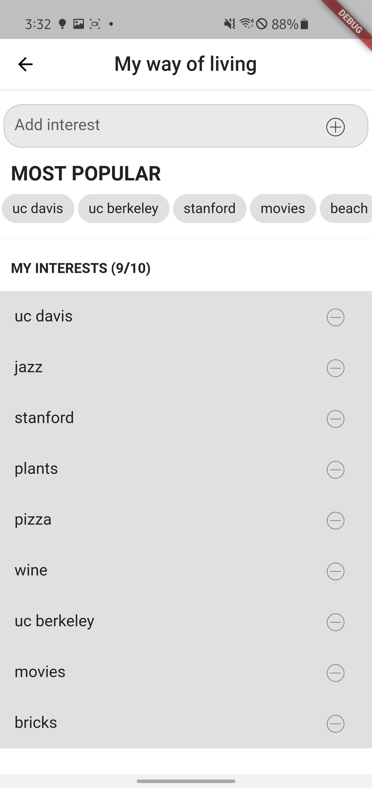
    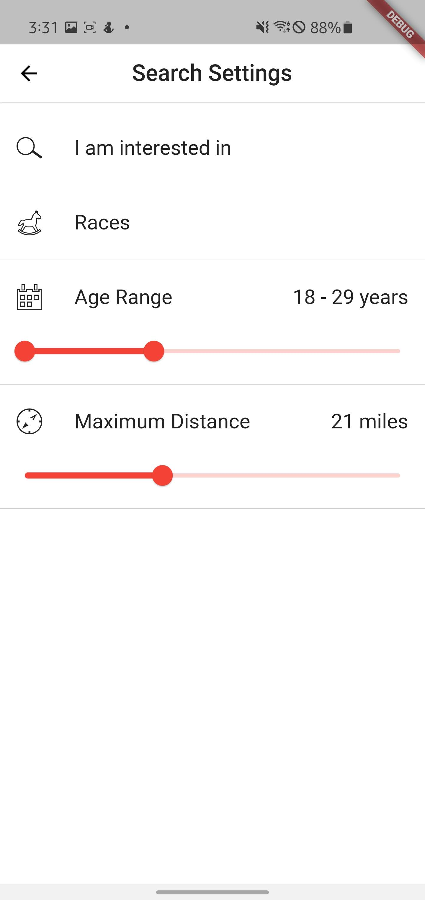

## First Interaction

Once the server finds the best match, a conversation between the two users is formed. In this conversation, the personal information and images of each users are not available.

*Side Note: To prevent the information of a user from being leaked by a malicious party, each client application only receives temporary user IDs that are not linked to any personal information in any database.*

### User Decision
After a certain amount of time (probably 24 hours). Each user is asked whether or not they enjoyed the interaction.

If the user says no, the interaction between the two users is ended.

If the user says yes, the server finds a group of potential candidates for the current user. This is a list of around 15 users. Here the user has the option to dismiss candidates they are not interested in. If the candidate does not find the other party attractive, **it will be dismissed and the interaction will be ended without knowing who the other person was**.

## Second Interaction

If both of users find each other attractive, their previous conversation is moved to a permanent screen. The conversation then reveals the personal information and images of both users.

    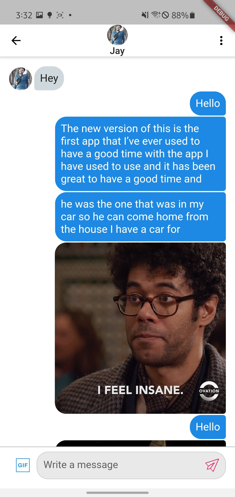
    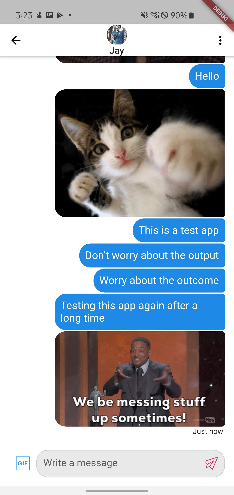
    

# Other Interactions

If a user wants to go out and does not want to wait and have a conversation, they can instead post a meeting opportunity, where other users can accept the opportunity. 

    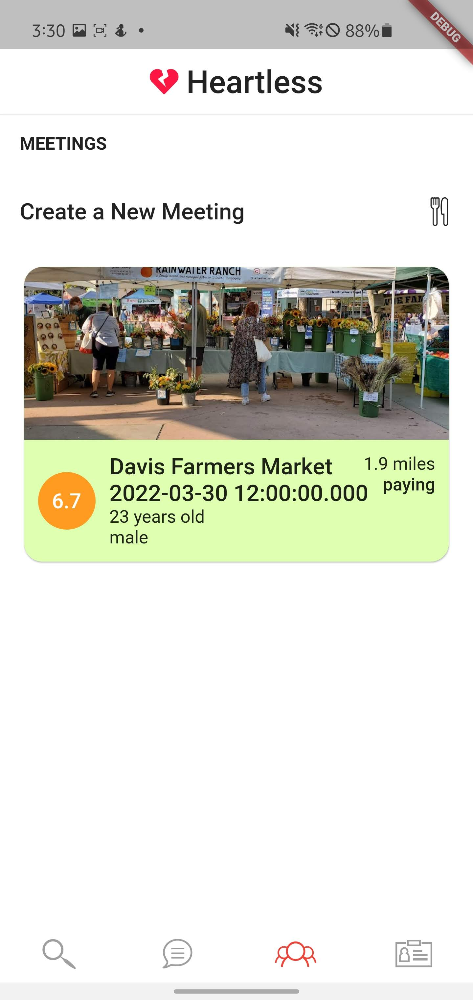
    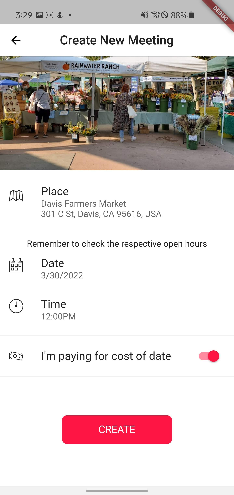

    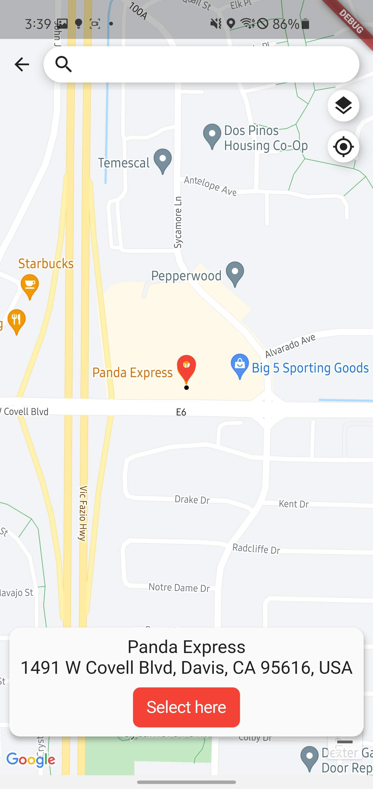
    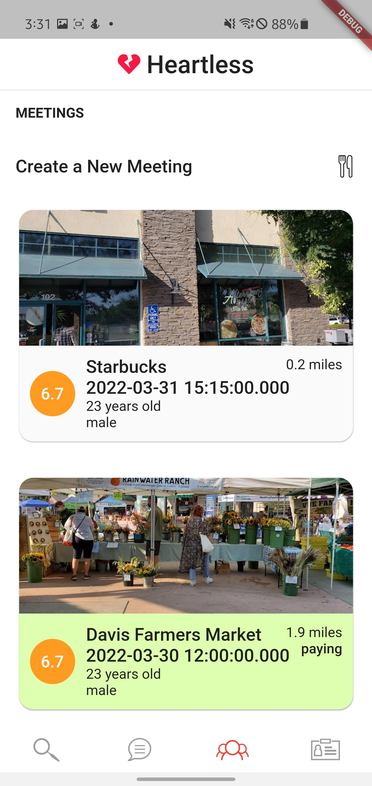

The "6.7" above represent the user rating. This number is based on past interactions and is supposed to help users have an idea of who posted this meeting opportunity.

## Finalizing Meeting
Both parties need to accept each other using the 15-candidate method before the meeting is finalized.

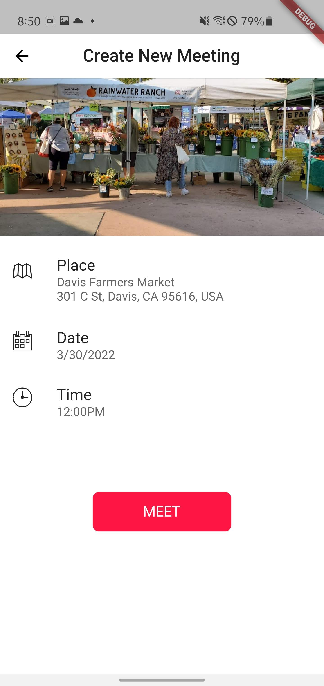

# Features

## Automatic Dark Mode

The application changes theme based on the device settings.

    
    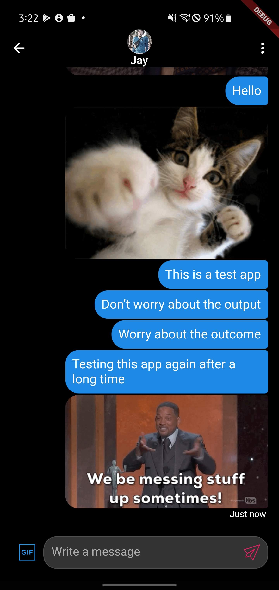

## Google Maps Integration

## GIPHY Integration

GIFs can be sent to other users thanks to integration with GIPHY.

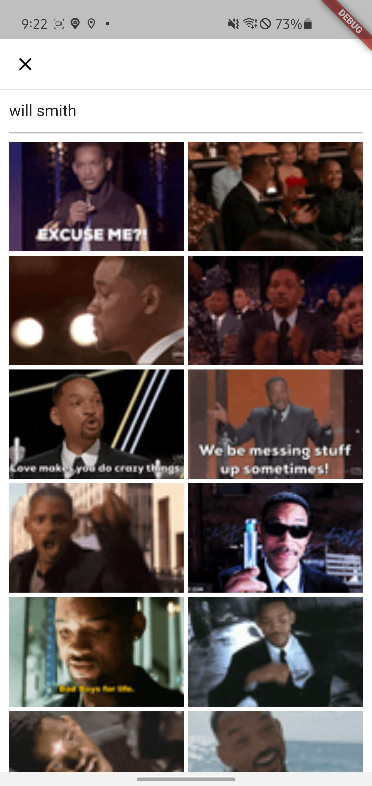

## App Settings

The app allows the user to control their profile as well device settings.

    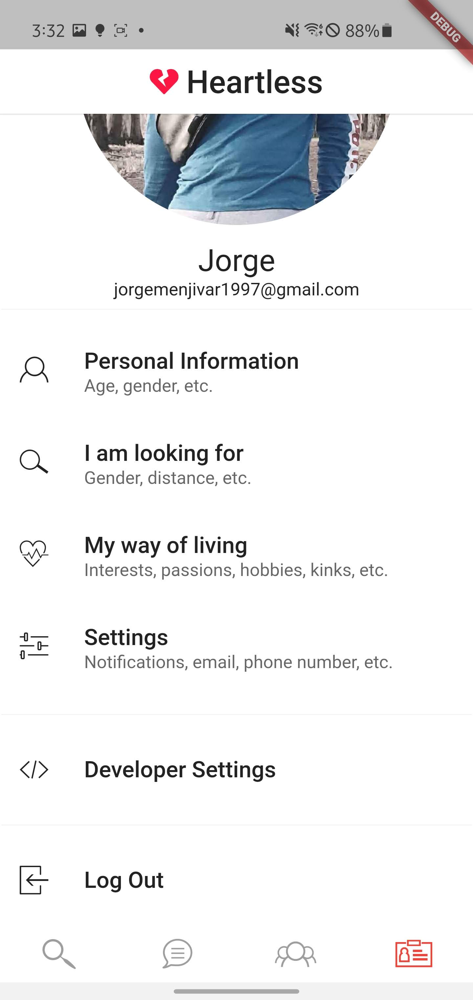
    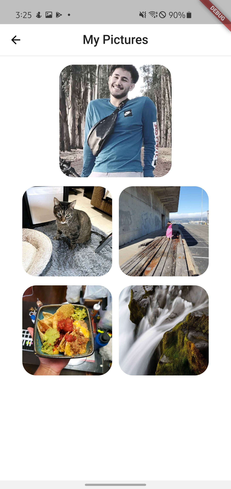
    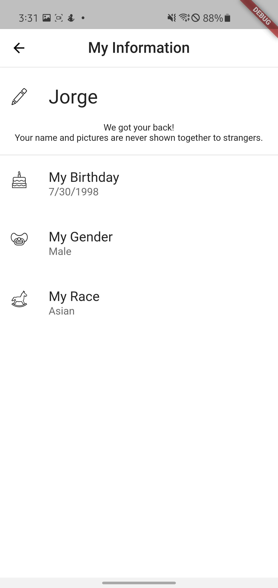
    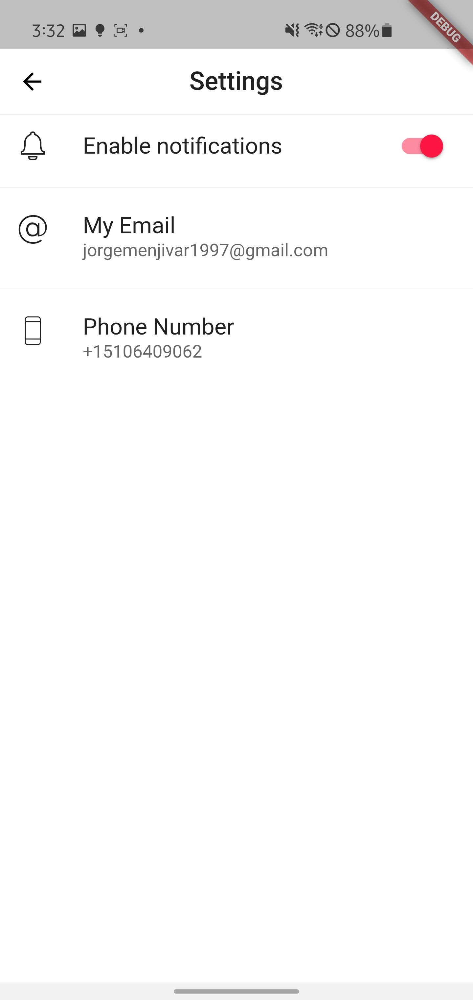

## Geolocation

Location services are needed to provide the features necessary for this app and therefore support for geo-location is included.

## Advertisements

Interstitial Advertising using Admob is set up in the app in case that this is later required.